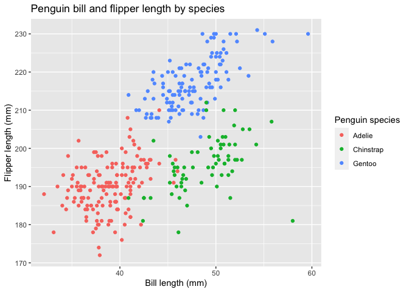

HW 1
================
Meghan Bellerose,
September 15, 2020

HW 1 Solutions

``` r
library(tidyverse)
```

## Problem 1

#### Create data frame

Create a data frame with the elements specified in problem 1:

  - A random sample of size 10 from a standard Normal distribution
  - A logical vector indicating whether elements of the sample are
    greater than 0
  - A character vector of length 10
  - A factor vector of length 10 with 3 factor levels

<!-- end list -->

``` r
prob1_df = 
  tibble(
    samp = rnorm(10),
    samp_gt_0 = samp > 0,
    char_vec = c("a", "b", "c", "d", "e", "f", "g", "h", "i", "j"),
    factor_vec = factor(c("low", "low", "low", "mod", "mod", "mod", "mod", "high", "high", "high"))
)
```

#### Take means

Take the mean of each variable in the data frame.

``` r
mean(pull(prob1_df, samp))
```

    ## [1] -0.04062681

``` r
mean(pull(prob1_df, samp_gt_0))
```

    ## [1] 0.3

``` r
mean(pull(prob1_df, char_vec))
```

    ## Warning in mean.default(pull(prob1_df, char_vec)): argument is not numeric or
    ## logical: returning NA

    ## [1] NA

``` r
mean(pull(prob1_df, factor_vec))
```

    ## Warning in mean.default(pull(prob1_df, factor_vec)): argument is not numeric or
    ## logical: returning NA

    ## [1] NA

We can take the mean of numbers and logical vectors, but not character
or factor vectors.

#### Convert variables from one type to another

Convert the logical, character, and factor vectors to numeric.

``` r
as.numeric(pull(prob1_df, samp))
```

    ##  [1] -0.4131816 -0.2158288 -0.4485788  0.4385652 -0.5444402  1.5448472
    ##  [7] -0.4168245 -2.4895404 -0.3233731  2.4620868

``` r
as.numeric(pull(prob1_df, samp_gt_0))
```

    ##  [1] 0 0 0 1 0 1 0 0 0 1

``` r
as.numeric(pull(prob1_df, char_vec))
```

    ## Warning: NAs introduced by coercion

    ##  [1] NA NA NA NA NA NA NA NA NA NA

``` r
as.numeric(pull(prob1_df, factor_vec))
```

    ##  [1] 2 2 2 3 3 3 3 1 1 1

When converted to numeric, the logical vector is reported as false = 0,
true = 1, which explains why it generated a mean.

Convert the logical vector:

  - To numeric and multiply the random sample by the result
  - To a factor and multiply the random sample by the result
  - To a factor and then convert the result to numeric and multiply the
    random sample by the result

<!-- end list -->

``` r
as.numeric(pull(prob1_df, samp_gt_0)) * pull(prob1_df, samp)
```

    ##  [1] 0.0000000 0.0000000 0.0000000 0.4385652 0.0000000 1.5448472 0.0000000
    ##  [8] 0.0000000 0.0000000 2.4620868

``` r
as.factor(pull(prob1_df, samp_gt_0)) * pull(prob1_df, samp)
```

    ## Warning in Ops.factor(as.factor(pull(prob1_df, samp_gt_0)), pull(prob1_df, : '*'
    ## not meaningful for factors

    ##  [1] NA NA NA NA NA NA NA NA NA NA

``` r
as.factor(pull(prob1_df, samp_gt_0)) * pull(prob1_df, samp)
```

    ## Warning in Ops.factor(as.factor(pull(prob1_df, samp_gt_0)), pull(prob1_df, : '*'
    ## not meaningful for factors

    ##  [1] NA NA NA NA NA NA NA NA NA NA

## Problem 2

#### Penguins dataset and size scatterplot

Load penguins dataset package.

``` r
data("penguins", package = "palmerpenguins")
```

The penguins dataset has eight variables: species, island, bill length
(mm), bill depth (mm), flipper length (mm), body mass (g), sex, and
year.

The data frame has 344 rows and `r ncol(penguins)` columns.

Create scatter plot of penguin flipper length by bill length.

``` r
ggplot(data = penguins, aes(x = bill_length_mm, y = flipper_length_mm)) + geom_point(aes(color = species)) + labs(title = "Penguin bill and flipper length by species", x = "Bill length (mm)", y = "Flipper length (mm)", color = "Penguin species") 
```

<!-- -->

Save the penguins plot\!

``` r
ggsave("penguins_scatter_plot.pdf", height = 4, width = 6)
```
